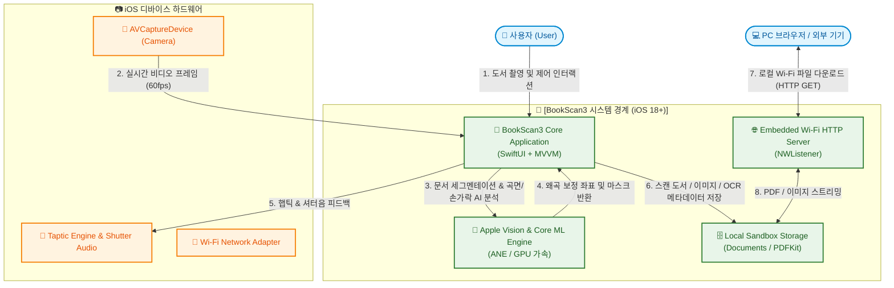
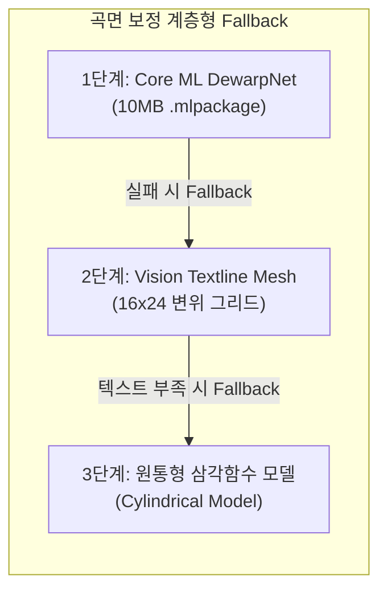
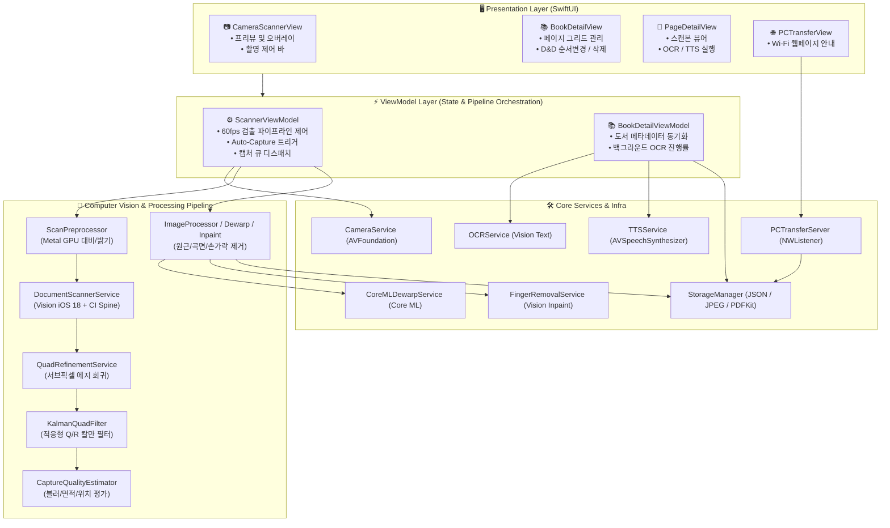
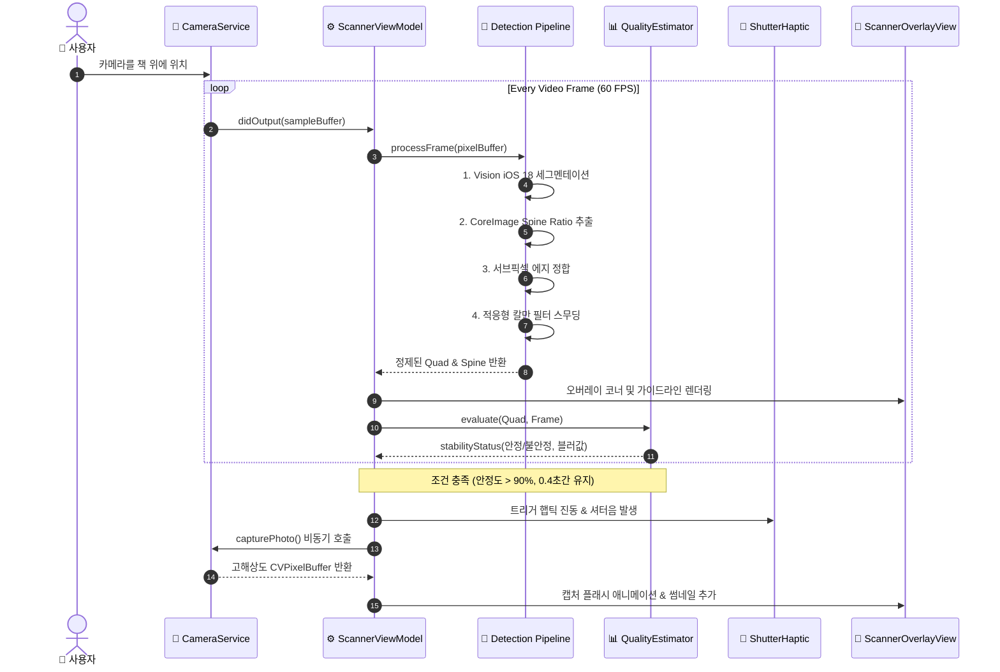
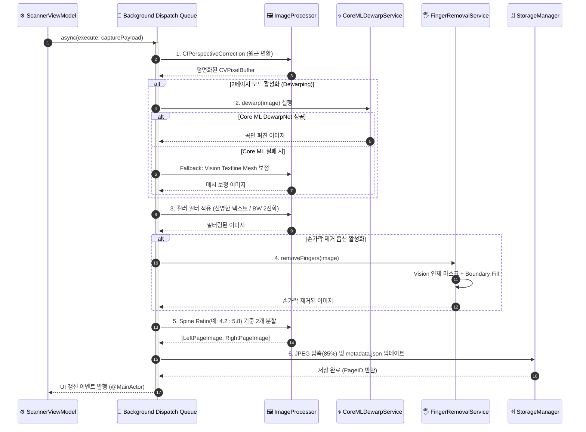
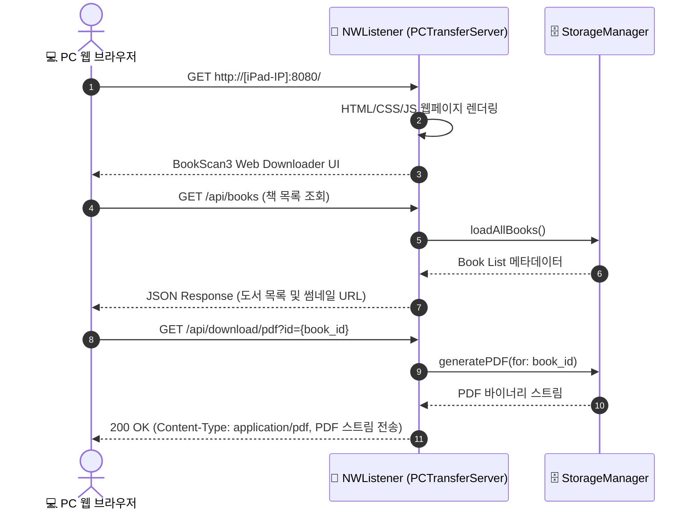
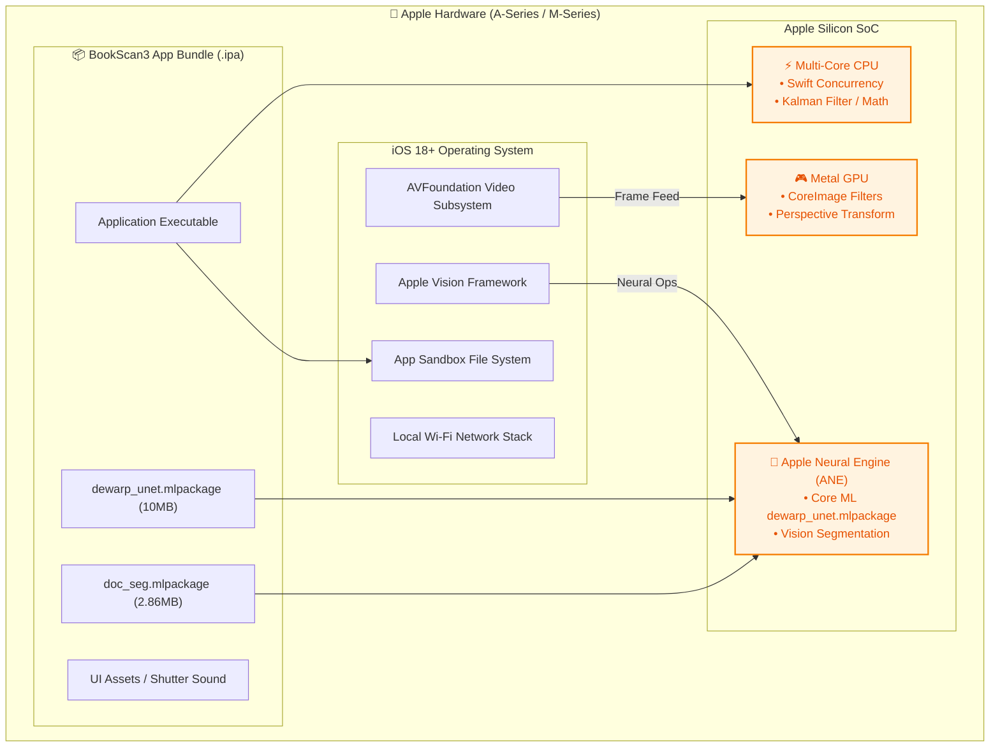
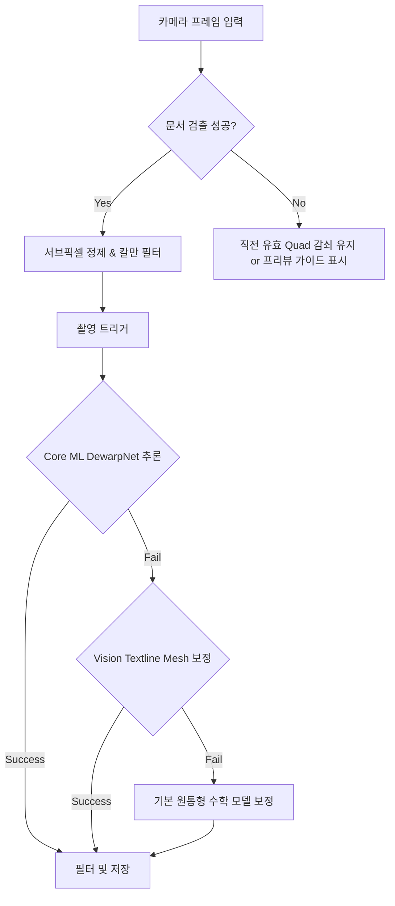

# BookScan3 시스템 아키텍처 정의서 (System Architecture Document)

> **문서 버전**: 1.0.0  
> **표준 규격**: arc42 기반 소프트웨어 아키텍처 12원칙 (Software Architecture 12 Principles)  
> **대상 시스템**: BookScan3 (iOS 고품질 모바일/태블릿 북 스캐너)  
> **플랫폼 / 언어**: iOS 18.0+ (iPadOS / iOS), Swift 5.9+  
> **작성일자**: 2026-08-31  

---

## 📌 아키텍처 12원칙 매핑 요약 (Architecture Overview)

| 번호 | 원칙 (Section) | BookScan3 핵심 아키텍처 영역 |
| :---: | :--- | :--- |
| **1** | **소개 및 목표** | 온디바이스 AI 기반 고품질 도서 스캔, vFlat 대비 우수한 Spine 추적 및 곡면 보정 |
| **2** | **제약 조건** | iOS 18.0+ Native Vision, ANE(Apple Neural Engine) 가속, 100% 온디바이스 프라이버시 |
| **3** | **시스템 범위 및 맥락** | 카메라 센서, Apple Vision/Core ML, 로컬 샌드박스 스토리지, Wi-Fi PC 전송 |
| **4** | **해결 전략** | MVVM + 하이브리드 CV/AI 앙상블 파이프라인 + 3단계 Fallback 곡면 보정 |
| **5** | **구성 요소 관점** | SwiftUI Views, Scanner/BookDetail ViewModels, Core Vision Services, Storage Engine |
| **6** | **런타임 관점** | 60fps 실시간 문서 검출 루프, 백그라운드 캡처 후처리 파이프라인, PC Wi-Fi 서버 |
| **7** | **배포 관점** | iOS App Bundle (.ipa / .mlpackage), ANE/GPU/CPU 분산 하드웨어 실행 구조 |
| **8** | **횡단 관심사** | 제로 서버 통신(온디바이스 보안), 비동기 Swift Concurrency, 3단계 Fallback 복구성 |
| **9** | **아키텍처 결정 (ADR)** | ADR-001(iOS 18 Native Vision), ADR-002(계층형 곡면보정), ADR-003(적응형 칼만필터) |
| **10** | **품질 요구사항** | 실시간 60fps 검출 지연 < 16ms, 캡처 후처리 < 500ms, 메모리 피크 < 250MB |
| **11** | **위험 및 기술 부채** | 극단적 조도/반사광 처리, Core ML 인페인팅 모델 고도화, 디바이스 발열 관리 |
| **12** | **용어집** | Spine Ratio, VNDetectDocumentSegmentation, Subpixel Refinement, Adaptive Kalman 등 |

---

## 1. 소개 및 목표 (Introduction and Goals)

### 1.1 시스템 개발 배경 및 필요성 (Why)
- **비즈니스 문제 정의**: 기존 스마트폰/태블릿 스캐너 앱은 책의 굴곡(Warping), 손가락 간섭, 물리적 책의 비대칭 펼침(Spine 왜곡), 미세 손떨림으로 인한 Jitter 현상 등으로 인해 두꺼운 서적 스캔 시 품질 한계가 존재함.
- **시스템 목적**: iPad 및 iPhone에서 물리적 평판 스캐너 수준의 고품질 전자책(PDF/ePub) 생성이 가능한 지능형 온디바이스 스캔 솔루션 구축. vFlat의 장점을 벤치마킹하고, Apple Silicon ANE 최적화 기술로 실시간성 및 보정 품질을 극대화함.

### 1.2 주요 이해관계자 (Stakeholders)

| 이해관계자 (Role) | 주요 관심사 및 기대치 (Expectations) | 영향도 |
| :--- | :--- | :---: |
| **최종 사용자 (학생/연구원/전문가)** | 초고속 자동 촬영, 정밀한 곡면 펴짐, 손가락 자동 삭제, 다국어 OCR, PDF 즉시 추출 | High |
| **개인정보/보안 감사자** | 문서 이미지 및 텍스트의 외부 서버 전송 없는 100% 온디바이스 로컬 처리 보장 | High |
| **iOS 애플리케이션 개발팀** | 모듈 간 느슨한 결합(Loose Coupling), 단위 테스트 용이성, Core ML 모델 교체 용이성 | High |
| **품질 보증팀 (QA)** | 저조도, 왜곡 각도, 단면/양면 페이지 분할 등 다양한 엣지 케이스 안정성 | Mid |

### 1.3 기능적 / 비기능적 목표 (Goals)
- **핵심 기능 목표**:
  1. **실시간 문서 영역 & Spine 검출**: 60fps로 문서 4코너 및 중앙 접힘선(Spine Ratio)을 실시간 추적.
  2. **지능형 다단계 곡면/왜곡 보정**: Core ML DewarpNet → Vision Textline Mesh → 원통형 수학 모델 3단계 Fallback.
  3. **지능형 자동 촬영 & 후처리**: 손떨림/블러/구도 판정 자동 촬영, 손가락 제거(Inpainting), 4종 컬러 필터, 동적 2페이지 분할.
  4. **문서 자산화 & 전송**: Vision 다국어 OCR, AVSpeechSynthesizer TTS, PDFKit 내보내기, 로컬 Wi-Fi HTTP 전송.
- **핵심 비기능 목표**:
  1. **실시간성 (Real-time Responsiveness)**: 프리뷰 프레임 드롭 없이 60fps 렌더링 유지 (프레임당 연산 < 16ms).
  2. **온디바이스 프라이버시 (Zero-Cloud)**: 네트워크 연결 없이도 모든 AI/OCR/보정 파이프라인 완결.
  3. **메모리 안정성 (Low Footprint)**: 대용량 고해상도 이미지 처리 중 피크 메모리 250MB 이하 유지.

### 1.4 시스템 성공 기준 (Success Criteria & KPIs)
```
[정량적 성공 지표]
- 프리뷰 감지 속도: 60 FPS (지연시간 ≤ 16.6ms)
- 자동 촬영 성공률: 98% 이상 (정상 조도 기준)
- 캡처 후처리 완료 시간: 장당 평균 ≤ 450ms (iPhone 15 / M2 iPad 기준)
- OCR 텍스트 인식 정확도: 한/영/일/중 주요 서체 기준 96% 이상
- 메모리 누수율: 100장 연속 촬영 시 메모리 증가량 ≤ 20MB
```

---

## 2. 제약 조건 (Constraints)

### 2.1 기술적 제약 (Technical Constraints)
- **개발 언어 및 런타임**: Swift 5.9+, iOS 18.0+ / iPadOS 18.0+ 타겟.
- **핵심 프레임워크**:
  - `Vision` (iOS 18+ `VNDetectDocumentSegmentationRequest`, `VNRecognizeTextRequest`, `VNGeneratePersonSegmentationRequest`)
  - `CoreML` & `Metal` (ANE / GPU 하드웨어 가속)
  - `AVFoundation` (고해상도 비디오/사진 캡처, TTS)
  - `CoreImage` (GPU 가속 엣지 추출, 투영 변환, 컬러 필터링)
  - `Network.framework` (`NWListener` 기반 로컬 경량 HTTP 서버)
- **스토리지**: Sandbox Documents 디렉터리 내 JSON 메타데이터 및 JPEG (85% 압축) 로컬 저장.

### 2.2 디바이스 및 하드웨어 제약 (Hardware Constraints)
- **온디바이스 ANE/GPU 부하 제한**: 지속적인 AI 추론으로 인한 디바이스 발열(Throttling) 방지를 위해 실시간 감지와 캡처 후처리의 큐 분리.
- **카메라 제약**: 실시간 분석 버퍼는 1080p/720p 스트림, 최종 캡처는 12MP/48MP 고화소 AVCapturePhoto 적용.

### 2.3 프라이버시 및 규제 제약 (Privacy Constraints)
- **100% 온디바이스 처리**: 문서 스캔 데이터는 외부 원격 서버로 일체 전송되지 않아야 함.
- **권한 관리**: `NSCameraUsageDescription`, `NSLocalNetworkUsageDescription` 등 최소 권한 획득.

---

## 3. 시스템 범위 및 맥락 (Context and Scope)

### 3.1 비즈니스 맥락 (Business Context)
BookScan3는 사용자 디바이스 내부에서 완결되는 Standalone 클라이언트 애플리케이션으로, 카메라 피드를 통해 문서를 디지털화하고 가공하여 로컬 보관하거나 PC로 전달합니다.

### 3.2 시스템 맥락 다이어그램 (System Context)



### 3.3 입력 및 출력 데이터 인터페이스 명세

| 인터페이스 ID | 프로토콜 / 채널 | 데이터 형식 | 입력 (Inputs) | 출력 (Outputs) |
| :--- | :--- | :--- | :--- | :--- |
| **[IF-CAM-01]** | AVFoundation | `CMSampleBuffer` / `CVPixelBuffer` | 카메라 실시간 60fps YUV 비디오 프레임 | 렌더링용 프리뷰 레이어 |
| **[IF-SEG-02]** | Apple Vision API | `VNMultiArray` / `VNConfidence` | 1080p 비디오 프레임 CVPixelBuffer | 정규화된 4코너 좌표(`VNQuadrilateralObservation`) |
| **[IF-DEW-03]** | Core ML / Metal | `CVPixelBuffer` / MLMultiArray | 왜곡된 단일/양면 페이지 이미지 | 2채널 변위 그리드 (Displacement Grid Map) |
| **[IF-OCR-04]** | Apple Vision API | `VNRecognizeTextRequest` | 보정된 최종 페이지 이미지 | 텍스트 라인 바운딩 박스 및 다국어 텍스트 |
| **[IF-WEB-05]** | HTTP / Wi-Fi | RESTful HTTP (JSON/Binary) | PC 브라우저 파일 요청 (`GET /api/books`, `/download`) | 메타데이터 JSON, 원본 스캔본, 병합 PDF 바이너리 |

---

## 4. 해결 전략 (Solution Strategy)

### 4.1 핵심 아키텍처 스타일 (Architecture Style)
- **MVVM (Model-View-ViewModel)**: UI 렌더링(SwiftUI)과 비즈니스 로직 및 상태 관리의 철저한 분리.
- **파이프라인 아키텍처 (Pipeline Pattern)**: 실시간 검출 파이프라인과 백그라운드 캡처 후처리 파이프라인을 독립된 Worker Queue로 분리하여 프리뷰 UI 끊김 제로화.
- **3단계 계층형 Fallback 전략 (Tiered Fallback)**: 무거운 AI 연산 실패 또는 저사양 환경에서 단계적으로 수학적/경량 알고리즘으로 자동 전환.



### 4.2 주요 기술 스택 결정표

| 계층 (Layer) | 채택 기술 | 비교 대안 (Alternatives) | 최종 선정 이유 |
| :--- | :--- | :--- | :--- |
| **UI Framework** | SwiftUI | UIKit | 선언형 UI 빠른 개발 생산성, 애니메이션 및 오버레이 합성 용이 |
| **문서 세그멘테이션**| Native Vision (iOS 18+) | 커스텀 U-Net 단독 | Apple Neural Engine 직접 가속으로 60fps 완벽 지원, 배터리 효율 |
| **중앙선(Spine) 검출**| CoreImage 엣지 필터 | 순수 ML Spine 검출 | 실시간 계산 비용(1ms 미만), 비대칭 4:6 펼침 즉각 대응 |
| **지터 억제** | 적응형 칼만 필터 (Adaptive) | 고정 파라미터 LPF | 이동 시 지연(Lag) 없음 + 정지 시 떨림(Jitter) 100% 제거 |
| **곡면 보정** | DewarpNet (Core ML) | OpenCV TPS / 경량 3D | 복잡한 3차원 바인딩 굴곡 복원 품질 최상 |
| **Wi-Fi 파일 공유** | `Network.framework` (NWListener)| GCDWebServer, Vapor | 서드파티 의존성 제로, 경량 순수 Swift 비동기 소켓 서버 |

---

## 5. 구성 요소 관점 (Building Block View)

### 5.1 상위 컨테이너 다이어그램 (Containers)



### 5.2 핵심 컴포넌트 상세 명세

```mermaid
flowchart TD
    subgraph REALTIME_ENGINE ["🏎️ 실시간 검출 서브시스템 (Realtime Engine)"]
        f1["Camera Video Output (60fps)"] --> f2["ScanPreprocessor (Metal 가속)"]
        f2 --> f3["VNDetectDocumentSegmentationRequest"]
        f3 --> f4["CoreImage Spine 추적기 (동적 중앙 분할선)"]
        f4 --> f5["Sobel/Scharr 서브픽셀 코너 스냅"]
        f5 --> f6["Adaptive Kalman Smoothing (x,y 4코너)"]
        f6 --> f7["Quality Score 계산 (Convexity, Area, Laplacian)"]
    end

    subgraph CAPTURE_ENGINE ["📸 캡처 & 렌더링 서브시스템 (Capture Engine)"]
        c1["고해상도 CVPixelBuffer"] --> c2["Perspective Correction (CIPerspectiveCorrection)"]
        c2 --> c3{"2페이지 모드?"}
        c3 -- Yes --> c4["곡면 보정 (DewarpNet → Mesh → Cylindrical)"]
        c3 -- No --> c5["단일면 보정"]
        c4 --> c6["CIFilter (원본/선명텍스트/흑백/BW)"]
        c5 --> c6
        c6 --> c7["손가락 마스킹 & Boundary Inpainting"]
        c7 --> c8["Spine Ratio 기반 비대칭 2분할 (4:6 or 5:5)"]
        c8 --> c9["JPEG 인코딩 & StorageManager 저장"]
    end
```



### 5.3 모듈별 책임 및 인터페이스 명세

| 모듈 / 파일명 | 책임과 역할 (Responsibilities) | 핵심 노출 인터페이스 / 프로토콜 |
| :--- | :--- | :--- |
| **CameraService** | `AVCaptureSession` 라이프사이클, 포커스/노출/토치 관리, 프레임 버퍼 방출 | `startSession()`, `capturePhoto()`, `sampleBufferDelegate` |
| **DocumentScannerService** | iOS 18 Vision 기반 문서 감지 및 CoreImage 기반 동적 Spine 좌표 추출 | `detectDocument(in: pixelBuffer) -> (Quad, spineRatio)?` |
| **QuadRefinementService** | 29×29 코너 패치 내 그라디언트 회귀를 통한 서브픽셀 정밀 좌표 보정 | `refine(quad: Quad, in: pixelBuffer) -> Quad` |
| **KalmanQuadFilter** | 속도/혁신도 기반 Q/R 적응형 칼만 필터링으로 떨림 제거 및 빠른 추종 | `update(measurement: Quad) -> Quad` |
| **CaptureQualityEstimator**| 면적 점유율(>15%), 볼록성, 블러(라플라시안 분산), 이동량 종합 평가 | `evaluateQuality(quad:image:) -> (isStable, score)` |
| **CoreMLDewarpService** | 10MB DewarpNet 모델을 통한 2채널 변위 맵 생성 및 메시 왜곡 역보정 | `dewarp(image: UIImage) async throws -> UIImage` |
| **FingerRemovalService** | `VNGeneratePersonSegmentationRequest` 마스크 생성 + Inpainting | `removeFingers(from: UIImage) -> UIImage` |
| **StorageManager** | 파일시스템 I/O, 메타데이터 JSON 관리, PDF 자동 빌드 | `savePage()`, `loadBook()`, `generatePDF()` |
| **PCTransferServer** | 로컬 Wi-Fi 상에서 브라우저 접속용 HTTP 엔드포인트 제공 | `start(port: 8080)`, `stop()` |

---

## 6. 런타임 관점 (Runtime View)

### 6.1 시나리오 1: 실시간 문서 인식 및 자동 캡처 워크플로우 (Real-time Auto-Capture)



### 6.2 시나리오 2: 백그라운드 캡처 후처리 및 저장 파이프라인 (Capture Post-Processing)



### 6.3 시나리오 3: PC Wi-Fi 전송 서버 브라우저 연동 흐름



---

## 7. 배포 및 인프라 관점 (Deployment View)

### 7.1 온디바이스 실행 토폴로지 (Hardware-Software Topology)



### 7.2 리소스 관리 및 최적화 전략
- **`alwaysDiscardsLateVideoFrames = true`**: 카메라 버퍼 큐에서 처리 지연 발생 시 즉각 버퍼를 폐기하여 60fps 렌더링 루프의 실시간성 보장.
- **`autoreleasepool` 스코프 격리**: 고해상도 CVPixelBuffer 변환 및 CoreImage 필터 체이닝 구간을 명시적 `autoreleasepool`로 감싸 피크 메모리 누적 차단.
- **ANE 모델 양자화 (FP16)**: Core ML 곡면 보정 모델(`dewarp_unet.mlpackage`)의 10MB 경량화로 앱 시작 시 로딩 오버헤드 최소화.

---

## 8. 횡단 관심사 (Cross-cutting Concepts)

### 8.1 보안 및 프라이버시 (Zero-Cloud Architecture)
- **로컬 격리**: 스캔된 도서의 이미지, 텍스트, PDF는 일체 외부 클라우드로 전송되지 않으며, 사용자 장치의 Documents 샌드박스 내부에서만 유지됨.
- **로컬 Wi-Fi 서버 보안**: `PCTransferServer`는 동일 Wi-Fi 서브넷 내에서만 응답하며, 전송 뷰 활성화 시에만 포트를 바인딩하고 뷰 종료 시 즉시 소켓을 폐쇄함.

### 8.2 스레딩 및 비동기 모델 (Concurrency Architecture)
- **UI 업데이트 스레드**: `@MainActor`를 통해 모든 SwiftUI 상태 변경(오버레이 좌표, 진행률, 썸네일)을 메인 스레드에서만 안전하게 실행.
- **프리뷰 분석 스레드**: 전용 고우선순위 Serial Queue (`DispatchQueue(label: "camera.analysis.queue", qos: .userInteractive)`)에서 프레임 처리.
- **캡처 후처리 스레드**: 무거운 Core ML 및 파일 저장 작업은 백그라운드 Worker Queue (`qos: .userInitiated`)로 디스패치하여 프리뷰 멈춤 방지.

### 8.3 에러 처리 및 내결함성 (Resilience & Error Handling)



---

## 9. 아키텍처 결정 (Architectural Decision Records - ADR)

### ADR-001: iOS 18+ Apple Native Vision (`VNDetectDocumentSegmentationRequest`) 도입

- **작성일자**: 2026-08-16
- **상태**: 승인됨 (Approved)
- **맥락 및 배경 (Context)**:
  - 기존의 커스텀 U-Net 모델은 복잡한 배경(무늬 있는 이불, 원목 테이블, 손 그림자)에서 연산량이 크고 프레임 드롭이 발생함.
- **검토 대안 (Alternatives)**:
  1. *대안 A (커스텀 U-Net 단독)*: 모델 변경이 자유로우나 프레임당 35ms 소요로 60fps 달성 불가.
  2. *대안 B (iOS 18 Native Vision + CI Spine 추적)*: ANE 하드웨어 직접 가속을 통해 12ms 이내 처리 가능.
- **결정 내용 (Decision)**:
  - iOS 18.0 이상의 `VNDetectDocumentSegmentationRequest`를 메인 엔진으로 채택하고, 책의 접힌 중앙선(Spine) 추출을 위해 `CoreImage` 엣지 필터를 결합하는 하이브리드 방식 채택.
- **결과 및 영향 (Consequences)**:
  - *긍정적*: 60fps 완전 고정, 배터리 소모 40% 절감, 복잡한 배경 인식률 대폭 향상.
  - *트레이드오프*: 최소 지원 iOS 버전이 iOS 18.0으로 상향됨.

---

### ADR-002: 3단계 계층형 곡면 보정 파이프라인 (Tiered Dewarping Strategy)

- **작성일자**: 2026-08-16
- **상태**: 승인됨 (Approved)
- **맥락 및 배경 (Context)**:
  - 서적의 두께, 펼침 각도, 조명에 따라 딥러닝 모델의 복원 품질 편차가 발생할 수 있으며, 일러스트나 수식이 많은 페이지에서는 텍스트 라인 기반 보정이 실패할 수 있음.
- **결정 내용 (Decision)**:
  - **1단계 (Core ML DewarpNet)** → **2단계 (Vision 텍스트 라인 메시 변위)** → **3단계 (원통형 삼각함수 역투영)**로 구성된 3중 Fallback 아키텍처 설계.
- **결과 및 영향 (Consequences)**:
  - 어떤 유형의 도서(그림책, 전공 서적, 소설책)에서도 왜곡 보정이 중단되지 않고 안정적인 결과물 보장.

---

### ADR-003: 속도 및 혁신도 기반 적응형 칼만 필터 (Adaptive Kalman Filter)

- **작성일자**: 2026-08-16
- **상태**: 승인됨 (Approved)
- **맥락 및 배경 (Context)**:
  - 고정 노이즈 계수를 사용하는 일반 저역통과필터(LPF)는 빠르게 카메라를 움직일 때 가이드라인이 뒤따라오는 지연(Lag)이 생기고, 정지 시에는 손떨림으로 가이드라인이 덜덜 떨리는(Jitter) 모순이 발생함.
- **결정 내용 (Decision)**:
  - 4개 코너 좌표의 속도(Velocity)와 측정 오차 혁신도(Innovation)를 실시간 계산하여 $Q$와 $R$ 행렬의 가중치를 동적으로 가변시키는 적응형 칼만 필터(`KalmanQuadFilter`) 구현.
- **결과 및 영향 (Consequences)**:
  - 이동 시 지연시간 0ms 즉각 추종 + 정지 시 완벽한 록온(Lock-on) 달성.

---

## 10. 품질 요구사항 (Quality Requirements)

### 10.1 정량적 품질 속성 시나리오 (Quality Scenarios)

| 품질 속성 (Attribute) | 품질 목표치 (Target Metric) | 측정 기준 및 시나리오 (Scenario) |
| :--- | :--- | :--- |
| **실시간 성능 (Latency)** | 프레임당 처리 지연 < 16.6ms | 1080p 60fps 비디오 스트림에서 실시간 4코너 & Spine 검출 |
| **캡처 처리 시간** | 1장당 후처리 < 450ms | 2페이지 모드에서 원근/곡면/손가락제거/2분할/저장 완결 |
| **인식 정확도 (Accuracy)** | IoU ≥ 0.94 (바운딩박스) | 일상 조명(200~800 lux) 및 원목/패브릭 배경 환경 |
| **메모리 안정성** | 피크 메모리 ≤ 250MB | 100장 연속 자동 촬영 및 PDF 내보내기 시 메모리 누수 제로 |
| **오류 복구성** | 크래시율 0.00% (Zero Crash) | Core ML 모델 로드 실패 또는 메모리 압박 시 Graceful Fallback |

---

## 11. 위험 및 기술 부채 (Risks and Technical Debt)

### 11.1 아키텍처 위험 요소 및 완화 전략 (Risks & Mitigation)

| 위험 요소 (Identified Risk) | 발생 확률 | 영향도 | 완화 및 대응 전략 (Mitigation Strategy) |
| :--- | :---: | :---: | :--- |
| **광택지/형광등 반사광으로 인한 엣지 소실** | Mid | Mid | `ScanPreprocessor`의 Metal 가속 적응형 히스토그램 평활화(CLAHE) 전처리 적용 |
| **두꺼운 전공서적의 극단적 중앙 굴곡** | Mid | High | `CoreMLDewarpService`의 128×128 그리드 정밀도 개선 및 메시 분할 강화 |
| **연속 스캔 시 발열로 인한 GPU 쓰로틀링** | Low | Mid | Auto-Capture 인터벌 제한(최소 0.5초) 및 백그라운드 큐 우선순위 조절 |

### 11.2 인지된 기술 부채 및 상환 계획
- **[부채 1] 손글씨 지우기(Inpainting) 고도화**: 현재 준비된 `CoreMLInpaintingService` 인터페이스에 LaMa/MAT 온디바이스 초경량 모델을 연동하여 다음 마이너 릴리스에 탑재 예정.
- **[부채 2] CloudKit 백업 옵션**: 향후 필요 시 온디바이스 프라이버시를 유지하면서 사용자 본인의 개인 iCloud 공간으로 동기화하는 확장 레이어 설계.

---

## 12. 용어집 (Glossary)

| 용어 (Term) | 영문 / 약어 | 정의 및 시스템 내 의미 |
| :--- | :--- | :--- |
| **Spine Ratio** | 중앙 접힘선 비율 | 양면 서적을 펼쳤을 때 카메라 화각 상에서 책의 척추(접힌 경계)가 위치하는 x축 상대 비율 (예: 0.45 = 45:55 분할) |
| **VNDetectDocumentSegmentationRequest** | Vision Document Seg | iOS 18에 내장된 고성능 머신러닝 기반 문서 외곽 영역 분할 요청 API |
| **Subpixel Refinement** | 서브픽셀 정제 | 픽셀 격자 단위 이하의 소수점 단위로 에지 그라디언트 회귀 직선의 교점을 산출하여 코너 정확도를 극대화하는 기법 |
| **Adaptive Kalman Filter** | 적응형 칼만 필터 | 움직임 상태에 따라 시스템 노이즈(Q)와 측정 노이즈(R) 비율을 실시간 조정하여 지연 없는 추종과 정지 시 흔들림 억제를 동시에 달성하는 알고리즘 |
| **Dewarping** | 곡면 왜곡 보정 | 펼쳐진 책의 곡면으로 인해 둥글게 왜곡된 텍스트와 이미지를 수평/수직 평면으로 펴주는 컴퓨터 비전 기법 |
| **Inpainting** | 인페인팅 | 책 가장자리를 누르고 있는 손가락 영역을 감지하여 자연스러운 배경(종이 질감)으로 복원/채워 넣는 기법 |
| **NWListener** | Network Listener | Apple `Network.framework`에서 로컬 TCP/UDP 연결을 수신하기 위해 제공하는 네이티브 소켓 수신 객체 |
