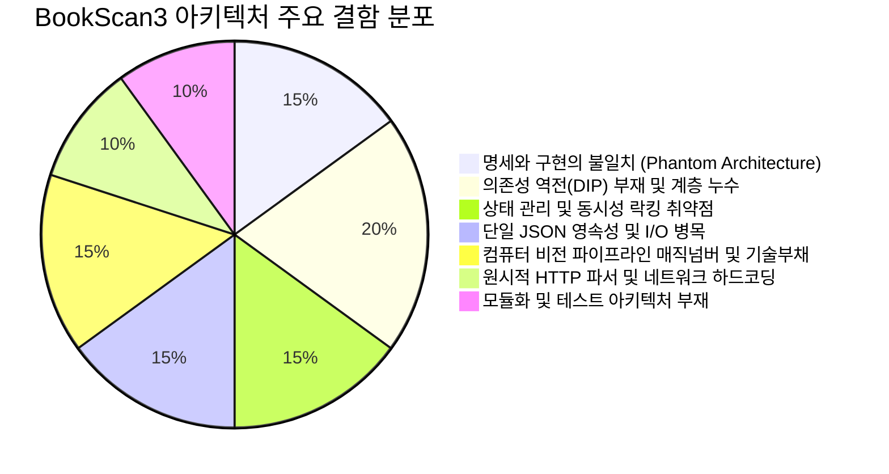

# BookScan3 아키텍처 종합 정밀 진단 보고서 (Architecture Audit Report)

> **문서 상태**: 완료 (Final)  
> **진단 일자**: 2026-09-13  
> **진단 대상**: BookScan3 iOS/iPadOS 프로젝트 전체 (`BookScan3`, `BookScan3Tests`, `BookScan3UITests`, `ARCHITECTURE.md`, `docs/*`)  
> **진단 목적**: 코드베이스 전반의 아키텍처 문제점 도출, 설계 결함 진단 및 개선 로드맵 수립  

---

## Executive Summary (총평)

BookScan3는 외부 서버 의존성 없는 100% 온디바이스 북 스캐너라는 명확한 목표 아래, Apple Native 프레임워크(SwiftUI, Vision, CoreImage, AVFoundation, Network.framework)를 능숙하게 결합한 우수한 프로토타입/MVP 코드베이스입니다. 특히 6점 기반 펼친 책 기하학 검증(`SpreadGeometry`), 원본 보존 기반 재보정 워크플로우, 백그라운드 캡처 분리 등 사용자 관점의 핵심 가치가 잘 구현되어 있습니다.

그러나 **엔터프라이즈 수준의 확장성, 안정성, 유지보수성 관점에서 분석했을 때 다음과 같은 8대 중대 아키텍처 결함**이 발견되었습니다:



---

## 1. 아키텍처 명세(Spec)와 실제 구현 간의 극심한 괴리 (Phantom Architecture)

### 1.1 현상 및 분석
- 기존 [ARCHITECTURE.md](file:///Users/windows/work/codex/0909sam/ARCHITECTURE.md)는 530여 줄에 달하는 arc42 기반 표준 아키텍처 문서로 작성되어 있습니다.
- 문서에서는 **Core ML DewarpNet 3단계 Fallback**, **Metal 가속 전처리(`ScanPreprocessor`)**, **서브픽셀 에지 정합(`QuadRefinementService`)**, **인페인팅 모델(`FingerRemovalService`)**, **60fps 초저지연 실시간 검출** 등을 핵심 아키텍처로 명시하고 있습니다.
- 그러나 실제 코드베이스에는:
  1. `dewarp_unet.mlpackage`, `doc_seg.mlpackage` 등 머신러닝 번들이 일체 존재하지 않습니다.
  2. `ScanPreprocessor`, `QuadRefinementService`, `FingerRemovalService` 등의 컴포넌트 클래스가 아예 구현되어 있지 않습니다.
  3. 실시간 검출은 60fps가 아닌 최대 약 8fps(`time - lastAnalysis > 0.12`)로 스로틀링되어 동작합니다.
  4. 곡면 보정은 Core ML 3단계가 아니라 단일 수평 삼각함수 워프 커널([CylindricalDewarpService.swift](file:///Users/windows/work/codex/0909sam/BookScan3/Services/CylindricalDewarpService.swift))만 동작합니다.

### 1.2 위험성 및 문제점
- **아키텍처 문서의 신뢰성 붕괴(Documentation Rot)**: 새로 합류한 엔지니어나 외부 감사자가 문서를 보고 설계된 시스템과 실제 동작 코드 사이에서 심각한 혼선을 겪게 됩니다.
- **성능 및 품질 예측 불가능**: 문서의 KPI(지연시간 < 16ms, 피크 메모리 < 250MB)가 실제 코드에서 검증되거나 보장되지 못하는 '환상 속의 목표'로 남아 있습니다.

---

## 2. 의존성 역전 원칙(DIP) 부재 및 계층 간 경계 침범 (Layer Leakage)

### 2.1 인터페이스 추상화 및 DI(의존성 주입)의 완전한 부재
- [Services](file:///Users/windows/work/codex/0909sam/BookScan3/Services) 계층의 핵심 클래스들([CameraService](file:///Users/windows/work/codex/0909sam/BookScan3/Services/CameraService.swift), [StorageManager](file:///Users/windows/work/codex/0909sam/BookScan3/Services/StorageManager.swift), [ImageProcessor](file:///Users/windows/work/codex/0909sam/BookScan3/Services/ImageProcessor.swift), [BookSpreadDetector](file:///Users/windows/work/codex/0909sam/BookScan3/Services/BookSpreadDetector.swift), [PCTransferServer](file:///Users/windows/work/codex/0909sam/BookScan3/Services/PCTransferServer.swift))에 대응하는 **Swift Protocol 추상화가 단 하나도 없습니다**.
- ViewModel이 서비스 구체 타입을 직접 인스턴스화하여 강하게 결합되어 있습니다:
  ```swift
  // ScannerViewModel.swift
  final class ScannerViewModel: ObservableObject {
      let camera = CameraService() // 구체 클래스 직접 생성
  ...
  // LibraryViewModel.swift
  final class LibraryViewModel: ObservableObject {
      let storage: StorageManager  // 구체 Actor 직접 소유
      private let ocr = OCRService() // 구체 Actor 직접 생성
  ```

### 2.2 View에서 Service 내부를 직접 침범하는 캡슐화 파괴
- MVVM 패턴에서는 View가 ViewModel의 상태를 구독하고, 사용자 의도를 ViewModel의 메서드로 전달해야 합니다.
- 그러나 현재 UI 코드에서는 View가 ViewModel 내부의 `storage` 인스턴스를 꺼내어 파일 I/O와 데이터 조작을 직접 수행합니다:
  ```swift
  // BookDetailView.swift (Line 116)
  Button("삭제", role: .destructive) {
      if var book, let deleting {
          book.pages.removeAll { $0.id == deleting.id }
          Task {
              await library.update(book)
              try? await library.storage.removeUnused(library.books) // View가 StorageManager 직접 호출!
          }
      }
  }

  // PageDetailView.swift (Line 59)
  review = try await library.storage.capture(captureID) // View가 Storage 직접 접근!

  // SpreadReviewView.swift (Line 78)
  let data = try await library.storage.source(record)   // View가 Storage 직접 접근!
  ```
- **문제점**: 데이터 접근 로직과 예외 처리가 View 레이어에 파편화되어 비즈니스 규칙의 일관성이 깨지고, ViewModel을 통한 상태 추적이 불가능해집니다.

---

## 3. 상태 관리 및 동시성(Concurrency) 락킹 취약점

### 3.1 단일 `busy: Bool` 플래그로 인한 비동기 요청 유실 (Silent Drop)
- [LibraryViewModel.swift](file:///Users/windows/work/codex/0909sam/BookScan3/ViewModels/LibraryViewModel.swift)는 앱의 모든 비즈니스 작업을 단 하나의 `@Published private(set) var busy = false` 플래그로 직렬화하고 있습니다.
- 도서 생성(`create`), 도서 수정(`update`), 도서 삭제(`delete`), 페이지 추가(`add`), 재보정 저장(`saveReviewed`), OCR 수행(`recognize`), 필터 적용(`apply`), PDF 내보내기(`export`) 등 모든 메서드가 `guard !busy else { return }`으로 시작합니다.
- **실제 발생하는 문제**:
  - 만약 10페이지에 걸쳐 OCR 작업(`recognize`)이 수초간 수행 중일 때 사용자가 책 제목을 바꾸거나 새 책을 추가하거나 페이지를 삭제하면, **어떠한 에러 메시지나 대기 큐 없이 요청이 즉시 무시(drop)**됩니다.
  - UI 작업 큐(Job Queue)나 비동기 작업 취소(Cancellation token) 체계가 없어 사용자는 앱이 멈춘 것처럼 느끼게 됩니다.

### 3.2 반환값과 에러 처리의 모호성 (Silent Failure)
- `LibraryViewModel.add` 메서드는 자동 저장이 성공했을 때도 `nil`을 반환하고, 예외가 발생하여 실패했을 때도 `nil`을 반환합니다:
  ```swift
  // LibraryViewModel.swift (Line 63-93)
  func add(...) async -> CaptureRecord? {
      guard !busy, books.contains(where: { $0.id == id }) else { return nil } // 차단 시 nil
      do {
          if split {
              ...
              guard detection.canAutoSave, !forceReview else { return record }
              try await saveCapturePages(record)
              return nil // 정상 완료 시 nil
          }
          ...
      } catch {
          self.error = error.localizedDescription // 실패 시 error 세팅 후 nil 반환
      }
      return nil
  }
  ```
- 호출 측인 `CameraScannerView`는 반환값이 `nil`인 이유가 "정상 자동 저장"인지, "busy로 인한 거절"인지, "I/O 에러 발생"인지 판별할 수 없습니다.

### 3.3 `@unchecked Sendable` 남용 및 스레드 경합 위험
- `CameraService`와 `PCTransferServer`가 `@unchecked Sendable`로 선언되어 있습니다.
- `CameraService`는 `sessionQueue`와 `analysisQueue`라는 2개의 커스텀 디스패치 큐와 메인 액터 사이에서 상태(`continuation`, `configured`, `spreadMode`, `previousSpread`)를 교차 갱신합니다. Swift 6 완전 동시성 검사(Complete Concurrency Checking) 활성화 시 컴파일 경고 및 런타임 데이터 레이스 위험이 있습니다.
- [ImageProcessor.context](file:///Users/windows/work/codex/0909sam/BookScan3/Services/ImageProcessor.swift#L63)가 전역 정적 변수(`static let context = CIContext(...)`)로 단 하나만 생성되어 카메라 분석 큐, 캡처 저장 큐, 썸네일 렌더링 큐에서 무제한 동시 접근합니다. Thread-safe하더라도 GPU 렌더 큐 병목을 유발합니다.

---

## 4. 영속성(Persistence) 및 데이터 계층 설계 결함

### 4.1 단일 거대 JSON 파일(`library.json`) 전수 쓰기 ($O(N)$ I/O 병목)
- [StorageManager.swift](file:///Users/windows/work/codex/0909sam/BookScan3/Services/StorageManager.swift)는 서재 전체 데이터를 `library.json` 단일 파일로 관리합니다.
- 페이지 1장의 텍스트가 OCR로 인식되거나, 페이지 필터가 변경되거나, 순서가 1칸 바뀔 때마다 **전체 서재의 모든 책과 모든 페이지 메타데이터 배열을 통째로 JSON 직렬화하여 원자적(atomic)으로 디스크에 덮어씁니다**:
  ```swift
  func save(_ books: [Book]) throws {
      try JSONEncoder().encode(books).write(to: root.appending(path: "library.json"), ...)
  }
  ```
- 도서가 수십 권, 페이지가 수천 장으로 증가하면 파일 크기 증가에 따라 쓰기 지연, 디스크 I/O 스파이크, 배터리 소모가 급격히 증가합니다.

### 4.2 트랜잭션 부재와 고아 파일(Orphan) 정리의 비효율
- 메타데이터(`library.json`), 캡처 레코드(`*.capture.json`), 원본 파일(`*.source`), 결과 이미지(`*.jpg`), 원본 보존 이미지(`*-original.jpg`), 썸네일(`*-thumb.jpg`)이 파일 시스템 상에 파편화되어 저장됩니다.
- 한 번의 캡처에 여러 파일이 기록되므로, 저장 도중 OOM이나 강제 종료 발생 시 파일 간의 원자성(Atomicity)이 깨집니다.
- 이를 해결하기 위해 `StorageManager.removeUnused`가 매번 Documents 디렉터리의 모든 파일을 선형 순회(`contentsOfDirectory`)하여 Set과 비교합니다. 파일 수가 5,000개를 넘어가면 디렉터리 탐색 자체가 심각한 프레임 드랍을 유발합니다.

### 4.3 쿼리 및 검색 인덱싱 부재
- [LibraryView.swift](file:///Users/windows/work/codex/0909sam/BookScan3/Views/LibraryView.swift#L16-L19)의 도서 검색은 인메모리에서 모든 책과 모든 페이지 텍스트를 선형 전수 탐색(`localizedCaseInsensitiveContains`)합니다. CoreData/SQLite와 같은 인덱스 기반 검색 엔진이 없어 서재 규모 확장에 취약합니다.

---

## 5. 컴퓨터 비전 파이프라인 및 보정 알고리즘의 한계

### 5.1 과도한 매직 넘버(Magic Numbers) 및 정적 휴리스틱 의존성
- [BookSpreadDetector.swift](file:///Users/windows/work/codex/0909sam/BookScan3/Services/BookSpreadDetector.swift)는 양면 검출과 접힘선(Seam) 추정을 수십 개의 고정 상수에 의존하고 있습니다:
  - 이미지 다운샘플링: `1000px`, `256px`, `192px`, `160px`
  - 영역 판정: `quad.area > 0.25`, `aspect > 1.12`, `topGap < 0.055`, `inner - outer > 0.07`
  - Seam DP 비용 함수: `costs[px] + Double(abs(px - x)) * 0.035`, `residual * 25`
- **문제점**: 책의 크기(판형), 조명 상태(역광, 간접광), 종이 재질(황색 재생지, 백색 아트지, 잡지 광택지), 여백 비율에 따라 검출률의 편차가 매우 큽니다.

### 5.2 Core Image Kernel Language(CIKL) 문자열 커널의 Deprecation
- [CylindricalDewarpService.swift](file:///Users/windows/work/codex/0909sam/BookScan3/Services/CylindricalDewarpService.swift#L6-L15)에서 `CIWarpKernel(source: ...)` 런타임 문자열 컴파일 방식을 사용합니다.
- Apple은 iOS 15 이후 CIKL 문자열 기반 셰이더 생성을 사실상 권장하지 않으며, Metal Shading Language(`.metal`)로 사전 컴파일된 `CIWarpKernel` 사용을 규정하고 있습니다.
- 런타임 컴파일 오버헤드가 발생하며, 단방향(수평) 왜곡만 단순 sin 곡선으로 펴주기 때문에 세로 방향 휨이나 실제 제본 굴곡을 완벽히 복원할 수 없습니다.

---

## 6. 네트워크 전송 모듈(PCTransferServer)의 안전성 및 호환성 결함

### 6.1 수제작 원시 HTTP 파서의 취약성
- [PCTransferServer.swift](file:///Users/windows/work/codex/0909sam/BookScan3/Services/PCTransferServer.swift#L5-L16)는 HTTP 요청을 `\r\n` 및 공백 분할 방식으로 파싱합니다.
- HTTP 표준(RFC 7230 / RFC 9112)의 다양한 요청 변형(헤더 대소문자, 다중 라인, 쿼리 파라미터 인코딩, 파이프라이닝)을 처리하지 못하며, 조각난 TCP 패킷 수신 시 비정상 연결 종료가 발생할 수 있습니다.

### 6.2 네트워크 인터페이스 `en0` 하드코딩
- [PCTransferServer.swift](file:///Users/windows/work/codex/0909sam/BookScan3/Services/PCTransferServer.swift#L124)의 IP 주소 조회 로직:
  ```swift
  guard let addr = current.pointee.ifa_addr, addr.pointee.sa_family == UInt8(AF_INET), 
        String(cString: current.pointee.ifa_name) == "en0" else { continue }
  ```
- **문제점**:
  - Wi-Fi 인터페이스가 항상 `en0`이라는 보장이 없습니다.
  - 셀룰러 지원 iPad, 개인용 핫스팟 환경, USB 이더넷 테더링 환경 등에서는 인터페이스명이 `pdp_ip0`, `bridge0`, `en1` 등으로 할당되므로, 정상적인 로컬 네트워크에 연결되어 있어도 주소를 가져오지 못하고 서버 실행이 실패합니다.

---

## 7. 테스트 아키텍처 및 모듈화의 결여

### 7.1 모놀리식 단일 타깃 구조
- 도메인 로직, 영상 처리 파이프라인, 로컬 스토리지, 네트워킹 소켓, SwiftUI 프레젠테이션이 모두 단일 `BookScan3` 앱 타깃에 묶여 있습니다.
- Swift Package Manager(SPM) 기반의 모듈화(`BookScanCore`, `BookScanVision`, `BookScanStorage`, `BookScanNetwork`)가 되어 있지 않아 타깃 간 의존성 제어가 불가능합니다.

### 7.2 ViewModel 단위 테스트 전무 및 통합 테스트 편향
- [BookScan3Tests](file:///Users/windows/work/codex/0909sam/BookScan3Tests)를 분석한 결과:
  - `BookScan3Tests.swift`: StorageManager 파일 I/O 및 PDFKit 통합 테스트 위주
  - `SpreadDetectionTests.swift`: 순수 기하학 수학 연산 위주
- **ViewModel 레이어(`LibraryViewModel`, `ScannerViewModel`)에 대한 단위 테스트가 단 1개도 작성되어 있지 않습니다**.
- 의존성 주입(DI)이 불가능한 구조이므로, ViewModel을 테스트하려면 실제 디스크 파일 시스템과 실제 카메라 세션이 연결되어야만 하는 한계가 원인입니다.

---

## 8. UI 및 프레젠테이션 레이어 설계 결함

### 8.1 `@EnvironmentObject` 전역 주입에 과도한 의존
- 최상위 [BookScan3App.swift](file:///Users/windows/work/codex/0909sam/BookScan3/BookScan3App.swift)에서 주입된 단일 `LibraryViewModel`이 모든 하위 뷰([LibraryView](file:///Users/windows/work/codex/0909sam/BookScan3/Views/LibraryView.swift), [BookDetailView](file:///Users/windows/work/codex/0909sam/BookScan3/Views/BookDetailView.swift), [CameraScannerView](file:///Users/windows/work/codex/0909sam/BookScan3/Views/CameraScannerView.swift), [SpreadReviewView](file:///Users/windows/work/codex/0909sam/BookScan3/Views/SpreadReviewView.swift), [PageDetailView](file:///Users/windows/work/codex/0909sam/BookScan3/Views/PageDetailView.swift))로 전역 전달됩니다.
- 개별 뷰가 필요로 하는 최소 상태 이상으로 전체 서재 뷰모델에 결합되어, 불필요한 뷰 리렌더링이 발생하고 SwiftUI Preview 구성이 어려워집니다.

### 8.2 시트(Sheet) 및 풀스크린 커버(FullScreenCover)의 다중 중첩
- `LibraryView` -> `CameraScannerView` (fullScreenCover) -> `BookDetailView` (sheet: results) -> `PageDetailView` (fullScreenCover) -> `SpreadReviewView` (fullScreenCover)
- 화면 위에 모달이 3~4단계로 겹쳐 열리면서 메모리 해제 지연 및 화면 닫힘 애니메이션 버벅임 현상이 발생합니다.

---

## 9. 종합 평가 및 개선 로드맵 (Remediation Roadmap)

| 영역 | 심각도 | 핵심 개선 과제 | 난이도 |
| :--- | :---: | :--- | :---: |
| **아키텍처 문서** | 🟡 중간 | `ARCHITECTURE.md`를 실제 구현 기준으로 동기화 개정하거나 목표 로드맵 분리 | 쉬움 |
| **DIP / DI** | 🔴 높음 | `StorageServiceProtocol`, `CameraServiceProtocol` 정의 및 생성자 주입 도입 | 보통 |
| **상태 관리** | 🔴 높음 | 단일 `busy` 플래그 제거, 세분화된 상태 머신 및 비동기 작업 큐(Task Queue) 도입 | 보통 |
| **영속성** | 🔴 높음 | 단일 `library.json` 탈피 -> SwiftData 또는 SQLite/GRDB 기반 경량 RDBMS 전환 | 높음 |
| **영상 처리** | 🟡 중간 | CIKL 커널을 Metal Shading Language(.metal) 컴파일 커널로 마이그레이션 | 보통 |
| **네트워킹** | 🟡 중간 | NWInterface 동적 열거(en0 하드코딩 제거) 및 표준 HTTP 파서/핸들러 보강 | 보통 |
| **테스트/모듈** | 🔴 높음 | Mock 서비스를 활용한 `LibraryViewModelTests` 단위 테스트 스위트 구축 | 보통 |

---
*본 보고서는 BookScan3 프로젝트의 지속 가능한 유지보수와 상용 수준 품질 확보를 위해 작성되었습니다.*
