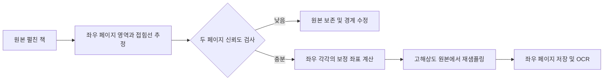

펼친 책 경계 검출·자동 분할 개선 조사
===================================

조사일: 2026-09-09. 대상: BookScan3 현재 소스 및 공개된 Apple API·연구 구현. 실제 실패 사진, vFlat 출력, 대상 iPad의 성능 측정 자료는 아직 없으므로 아래에서 코드로 확인한 사실, 공개 자료의 사실, 개선 제안을 구분한다. 앱 소스는 변경하지 않았다.

**판단: 현재보다 개선할 여지는 크다. vFlat과 비교할 수 있는 수준을 목표로 하려면 ‘책 한 권의 사각형’에서 ‘좌우 두 페이지의 영역과 공유 접힘선’으로 검출 대상을 바꾸는 것이 핵심이다.** Vision 파라미터 조절이나 곡면 필터 추가만으로 동급 품질이 확보된다고 볼 근거는 없다.

vFlat은 공식적으로 책/문서 자동 검출, 곡면 펴기, 손가락 제거, 펼친 두 페이지 촬영을 제공한다. 다만 확인한 공식 소개에는 내부 모델·학습 데이터·정확도 벤치마크가 공개되어 있지 않다. 이 보고서의 설계는 vFlat의 내부 구현을 재현했다는 주장이 아니다. [vFlat 공식 기능](https://www.vflat.com/en), [개발자 App Store 설명](https://apps.apple.com/gb/app/vflat-scan-pdf-ocr-scanner/id1540238220)

**현재 코드에서 확인한 원인**

| 위치 | 현재 동작 | 펼친 책에서 예상되는 실패 |
| --- | --- | --- |
| `ImageProcessor.swift:65` | Vision 첫 결과 하나만 채택, confidence > 0.5, 4개 꼭짓점만 유지 | 책 전체/왼쪽/오른쪽/책 속 사각형을 구별하는 평가가 없다. 반환 가능한 문서 영역 마스크를 버린다. |
| `ImageProcessor.swift:79` | 검출한 사각형 전체에 원근 보정을 먼저 수행하고 그 결과를 둘로 자름 | 한쪽 페이지만 검출되면 그 한 페이지를 다시 둘로 나눈다. 두 면의 기울기가 다를 때 하나의 평면 보정으로 양쪽을 모두 펴기 어렵다. |
| `ImageProcessor.swift:82` | 검출 결과가 nil이면 전체 사진을 그대로 분할 | 인식 실패를 정상적인 양면 스캔 결과와 구별하지 않아 배경까지 두 장으로 저장할 수 있다. |
| `ImageProcessor.swift:95` | 이미지를 160×120으로 변형하고 중앙 약 30~70%에서 가장 어두운 열 선택 | 글자·검은 삽화·손 그림자를 접힘선으로 오인할 수 있다. 밝은 접힘선, 기울어진 선, 휘어진 선은 표현할 수 없다. |
| `CameraService.swift:93`, `ScannerViewModel.swift:19` | 프리뷰에서는 최대 약 8fps로 추적하지만 촬영 콜백에는 사진 Data만 전달 | 촬영 후 검출이 프리뷰와 독립적이다. 사용자가 본 경계와 최종 저장 경계의 일치 여부를 검사하지 않는다. |
| `CylindricalDewarpService.swift` | 강도에 따른 수평 sin 좌표 변환 | 종이 경계나 글자 곡률을 추정하지 않으므로 잘못 잡힌 경계를 고칠 수 없다. 수직 방향 휨도 복원하지 않는다. |
| `StorageManager.swift:25` | 보정·분할을 마친 이미지를 originalName으로 저장 | 전체 촬영 원본이 없어 잘못 잘린 영역을 나중에 되살릴 수 없다. |
| `BookScan3Tests.swift:45` | 합성 이미지에 수동 spine=0.4를 지정하여 이미지 생성·폭 비율 검사 | 자동 접힘선 추정, 실제 책의 좌우 경계 정확도, 글자 잘림은 검증하지 않는다. 기존 테스트 통과는 스캔 품질 검증이 아니다. |

Apple은 `VNDetectDocumentSegmentationRequest`를 텍스트가 있는 사각형 영역 검출로 설명하며, 결과에 사각형과 saliency mask가 포함된다고 명시한다. `globalSegmentationMask`는 nullable이므로 없는 경우도 처리해야 한다. 이 API 자체에 ‘서로 다른 곡면인 좌우 책 페이지를 항상 분리한다’는 보장은 없다. 설치된 Xcode SDK에서도 마스크 접근 API를 확인했다. [문서 검출 API](https://developer.apple.com/documentation/vision/vndetectdocumentsegmentationrequest), [마스크 API](https://developer.apple.com/documentation/vision/vndetectedobjectobservation/globalsegmentationmask)

**가장 먼저 적용할 개선: 기존 Apple 기능과 기하 검증**

1. 원본 사진과 촬영 시점의 검출 정보를 먼저 보존한다. 두 페이지가 하나의 원본을 공유하도록 `captureID`, 원본 파일명, 픽셀 크기, EXIF 방향, 프리뷰 좌표 변환, 페이지 경계, 접힘선, 검출 신뢰도, 처리 버전을 저장한다. 이후 경계 수정으로 두 장을 다시 생성할 수 있게 한다.
2. 단면과 펼친 책의 검출 경로를 분리한다. 펼친 책에서는 전체 마스크, 좌우 관심영역의 검출 결과, 사각형 후보, 윤곽 후보를 수집한다. 가장 큰 후보나 첫 후보를 곧바로 확정하지 않는다.
3. Vision 마스크가 있으면 윤곽을 추출하고, 원본 이미지의 경계 근처 좁은 영역에서 정밀화한다. `VNDetectContoursRequest`를 활용할 수 있다. 마스크가 처음부터 한쪽 페이지만 포함하면 이 단계만으로 빠진 반대쪽을 찾을 수 없으므로 별도 후보 생성이 필요하다. [Apple 윤곽 검출](https://developer.apple.com/documentation/vision/vndetectcontoursrequest)
4. `VNDetectRectanglesRequest`를 보조 검출기로 사용해 여러 후보를 얻는다. 종횡비·크기·각도 허용 범위는 책 사진 평가 세트에서 조정한다. 강하게 휜 페이지를 사각형으로 정확히 표현하지는 못하므로 초기 추정 및 fallback 용도다. [Apple 사각형 검출](https://developer.apple.com/documentation/vision/vndetectrectanglesrequest)
5. 최소 표현을 외곽 네 점과 접힘선 위·아래 두 점의 6점으로 늘린다. 좌우 각각 네 점의 평면으로 보정한다. 이후 페이지 윤곽 및 접힘선을 여러 점의 곡선으로 확장한다. 좌우 면적이 같아야 한다고 강제하면 비대칭 펼침을 다시 놓치므로, 양쪽이 물리적으로 일관되게 접하는지만 점수화한다.
6. 접힘선을 단일 x 비율에서 위→아래의 연속 경로로 바꾼다. 밝기, 그라디언트, 양쪽 페이지 영역의 접촉, 위·아래 접힘점, 텍스트와 교차하는 정도, 이전 프레임 정보를 결합한다. 동적 계획법으로 매끄러운 경로를 찾고 신뢰도를 산출하는 방식을 첫 실험으로 권장한다. ‘어두우면 접힘선’ 가정만으로 결정하지 않는다.
7. 자동 촬영은 ‘한 사각형이 안정됨’ 대신 ‘좌우 모두 존재하고 경계·접힘선이 안정됨’을 요구한다. 두 장이 유효하게 분리되지 않으면 원본을 보존하고 재촬영 또는 경계 수정으로 연결한다. 흐릿한 영역도 사진 중앙 전체가 아니라 좌우 페이지별로 평가한다.
8. 프리뷰에는 좌우 윤곽과 접힘선을 함께 보여 준다. 촬영 후 고해상도 검출은 프리뷰를 초기값으로 쓰되, 사진/비디오 화각·크롭·방향을 변환하고 실제 사진 경계에 다시 맞춘다. 좌표를 단순 복사하지 않는다. 시간 간격이 크거나 회전/움직임이 있으면 프리뷰 추정을 폐기한다.

1차 개선의 기대효과는 한쪽만 검출한 뒤 오분할하는 문제, 배경 저장, 비대칭·기울어진 접힘선의 오차 감소다. 실제 사진으로 측정하기 전 개선율을 숫자로 약속할 수 없다. 흰 책상 위 흰 종이, 심한 곡면·손가락 가림에는 학습 기반 영역 인식이 더 유리할 가능성이 높다.

**vFlat과 경쟁할 목표 구조: 페이지 영역 인식 + 페이지별 곡면 보정**

권장 데이터 구조는 `SpreadObservation(leftPage, rightPage, spineCurve, confidence, timestamp, coordinateTransform)`이다. 각 페이지에는 polygon/mask, visibility, 잘림 여부, 보정 grid를 둔다. 예측상 페이지 전체 영역과 실제로 보이는 종이 픽셀을 구분해 손가락 가림을 표현한다. 좌우 겹침·순서 역전·접힘선 단절·화면 밖 경계·텍스트 잘림을 별도로 검사한다.

학습 모델의 첫 후보는 가벼운 CNN encoder-decoder다. 배경/왼쪽 종이/오른쪽 종이를 구분하는 출력과 접힘선·주요 점을 추정하는 출력을 함께 학습한다. 손 영역은 별도 occlusion 출력으로 분리할 수 있다. 입력 해상도 384~640은 실험 범위이지 확정 사양이 아니다. 저해상도 모델이 구조를 찾고 고해상도 영상에서 경계를 정밀화하는 방식으로 메모리와 속도를 조절한다.

중요한 점은 **곡면 보정 모델을 교체하는 것만으로 두 페이지 검출이 해결되지 않는다는 것**이다. 먼저 좌우를 안전하게 구분하고, 각 페이지에 대해 종이 경계와 내부 글줄을 평탄화해야 한다. 원본의 바깥 영역을 일찍 잘라 버리지 말고 여유 영역을 유지한 채 최종 렌더링한다. 가능하면 원근 변환과 곡면 변환을 합성하여 반복 보간으로 작은 글씨가 흐려지는 것을 줄인다.

| 후보 | 공개 자료에서 확인한 내용 | 이 앱에서의 권장 용도와 한계 |
| --- | --- | --- |
| UVDoc | 2D/3D grid를 함께 예측하는 문서 펴기 연구. 공식 PyTorch 코드·모델 제공. 저장소 MIT 라이선스 | 페이지별 곡면 보정의 우선 실험 후보. 두 페이지 검출기로 간주하면 안 된다. Core ML 변환 및 iPad 실측이 필요하다. |
| DocScanner | 문서 위치 검출과 점진적 보정 구조. 공개 표에 T/B/L 모델 2.6/5.2/8.5M 파라미터 기재 | 품질 비교 및 구조 참고. 제공 체크포인트와 작은 변형의 이용 가능성 확인 필요. 라이선스는 비상업 조건과 상업 사용 사전 허가를 명시한다. |
| DewarpNet | 2019년의 3D/2D 회귀 기반 방법, 공식 학습 코드·모델 제공 | 기존 ARCHITECTURE의 후보로 비교할 수 있다. 문서의 ‘10MB Core ML 파일’이 준비돼 있다고 가정할 수 없다. |
| 경계·텍스트 기반 grid 최적화 | CVPR 2022 연구는 경계점과 텍스트 라인 픽셀을 학습하고 grid 제약으로 펴기 | 혼합 방식의 근거. Vision OCR의 직사각형 박스만 이어 붙인다고 곡선 글줄이 복원되는 것은 아니다. |

근거: [UVDoc 연구](https://igl.ethz.ch/projects/uvdoc/), [UVDoc 공식 구현](https://github.com/tanguymagne/UVDoc), [UVDoc LICENSE](https://github.com/tanguymagne/UVDoc/blob/main/LICENSE), [DocScanner 공식 구현](https://github.com/fh2019ustc/DocScanner), [DocScanner LICENSE](https://github.com/fh2019ustc/DocScanner/blob/main/LICENSE.md), [DewarpNet](https://github.com/cvlab-stonybrook/DewarpNet), [Grid Regularization 논문](https://openaccess.thecvf.com/content/CVPR2022/html/Jiang_Revisiting_Document_Image_Dewarping_by_Grid_Regularization_CVPR_2022_paper.html)

UVDoc 공식 데모는 축소 이미지에서 2D grid를 예측한 뒤 원래 크기의 이미지에 적용한다. 이를 참고해 **Core ML에는 grid 추정, Metal에는 고해상도 재샘플링**을 맡기는 분리를 제안한다. 다만 변환 과정의 RGB 순서·정규화·resize 방식·좌표계·보간 규칙이 원본 구현과 같아야 한다. Core ML 변환 성공과 ANE 실행 성공, 품질 유지, 속도 충족은 서로 다른 검증 항목이다. [UVDoc 공식 demo.py](https://github.com/tanguymagne/UVDoc/blob/main/demo.py)

PaddlePaddle도 UVDoc를 배포하며 모델 카드에는 Apache-2.0을 표시하고 있다. 배포 파일의 파라미터 크기는 약 32.1MB지만 이를 iPad 실행 메모리나 원저자 체크포인트 크기로 해석하면 안 된다. 채택할 구현·가중치·학습 데이터의 조건을 각각 기록해야 한다. [Paddle UVDoc 모델 카드](https://huggingface.co/PaddlePaddle/UVDoc), [배포 파일](https://huggingface.co/PaddlePaddle/UVDoc/tree/main)

경계가 일부 가려지거나 사진 밖으로 나간 사례를 위한 연구로 MataDoc과 DocTr++도 있다. 이런 방법은 불완전한 관찰로 기하를 추정하는 참고 자료이며, 사진에 없는 글자를 실제 원문대로 되살린다고 해석하면 안 된다. 우선은 재촬영·원본 보존·수동 수정이 필요하다. [MataDoc](https://arxiv.org/abs/2307.12571), [DocTr++](https://github.com/fh2019ustc/DocTr-Plus)

**학습보다 먼저 필요한 실제 평가 세트**

최초 회귀 평가용으로 서로 다른 책 20권 이상, 펼친 장면 200~500개를 제안한다. 이는 시작 규모이며 통계적인 동등성을 입증하기에 충분하다는 뜻은 아니다. 같은 페이지·같은 촬영 시퀀스가 학습과 테스트 양쪽에 들어가지 않도록 책과 촬영 세션 단위로 분리한다. 모델 미세조정은 그 뒤 별도의 실제 라벨 데이터 수천 장을 출발점으로 검토하고 학습곡선에 따라 늘린다.

- 책 두께: 얇은 책, 일반 단행본, 두꺼운 전공서.
- 내용: 한글/영문, 수식, 표, 양면 삽화, 사진, 빈 페이지.
- 배경과 광원: 흰 책상, 무늬 천, 어두운 바탕, 한쪽 그림자, 반사광.
- 형태: 50:50/40:60/30:70 펼침, 접힘선 기울어짐, 위아래가 휜 종이, 손가락 가림.
- 촬영: 세로/가로, 흔들림, 회전 직후, 페이지 넘김, 가장자리 일부가 화면 밖인 경우.

각 사진에 좌우 페이지의 목표 윤곽, 접힘선, 가림 영역, 잘리면 안 되는 글자/그림 영역을 표시한다. 정밀 곡면 평가용 일부는 평판 스캔 또는 충분히 평탄한 정답 이미지와 짝을 만든다. 공개 UVDoc/Doc3D는 보정 학습의 출발점으로 유용하지만 이 앱의 실제 양면 책 테스트를 대체하지 않는다. [UVDoc 데이터·평가 설명](https://igl.ethz.ch/projects/uvdoc/)

vFlat과는 두 종류로 비교한다. 이미지 가져오기에서 동등한 양면 기능을 사용할 수 있는 경우 동일한 원본으로 영상 처리만 비교하고, 별도로 동일 기기·책·조명·거치 위치에서 실제 자동 촬영 경험을 비교한다. vFlat 버전·OS·옵션을 고정해 기록한다. 내보낸 페이지 이미지를 같은 OCR 엔진에 넣어 인식률을 비교해야 경계/보정 개선과 OCR 엔진 차이를 구분할 수 있다.

| 지표 | 측정 방법 |
| --- | --- |
| 양면 검출 성공률 | 전체 촬영 시도 중 양쪽 페이지가 정확히 대응되는 비율 |
| 내용 보존 | 정답의 글자·수식·삽화가 잘린 페이지/촬영 시도의 비율. 경계 IoU가 높아도 별도로 집계 |
| 경계 정확도 | 좌우 각각의 mask IoU 및 이미지 대각선으로 정규화한 경계 거리 |
| 접힘선 정확도 | 정답 곡선과 예측 곡선의 평균·상위 백분위 거리, 다른 페이지 내용 혼입 여부 |
| 자동화 품질 | 자동 저장 성공률과 ‘잘못 저장한 비율’을 함께 보고, 수정 요청 빈도·횟수 기록 |
| 평탄화 품질 | 글줄 직선성, 표/수식 모양 보존, 동일 OCR의 CER |
| 실행 성능 | 프리뷰 FPS와 검출 FPS 분리, 촬영→양면 저장 p50/p95, 피크 메모리, 100장 연속 처리의 발열/성능 저하 |

내부 첫 목표 예시로 일반 조건 양면 검출 95% 이상, 잘못 자동 확정 1% 이하, 글자 잘림 1% 이하를 둘 수 있다. **측정치가 아닌 제안 목표다.** 보류를 늘리면 오저장은 줄기 때문에 자동 처리율도 반드시 함께 보고, 실제 vFlat 결과를 얻은 뒤 동일 조건에서 허용 차이와 신뢰구간을 정해 ‘맞먹는다’의 기준을 고정한다. 어려운 조건을 평균에 숨기지 않는다.

**iPad 배치 전략과 우선순위**

기기 모델이 확정되지 않은 상태에서는 특정 지연시간을 보장하지 않는다. iPad 11세대 A16과 11인치 Air/Pro를 같은 성능으로 가정하지 않는다. 목표 기기의 가장 느린 조건을 기준으로 설계한다.

프리뷰는 기기가 지원하는 30/60fps, 구조 검출은 우선 8~15fps 범위에서 조절하고 최종 정밀 처리는 사진당 한 번 수행하는 구성을 권장한다. 이는 실험 목표이며 보장 사양이 아니다. 좌우 고해상도 처리는 순차 실행하고 중간 버퍼를 재사용한다. Core ML FP16부터 품질을 확인한 뒤 정량화/팔레트화를 검토한다. 모델 용량이 작아져도 특정 iPad에서 빨라진다는 보장은 없다는 점은 Apple 문서에도 명시되어 있다. [Core ML 최적화 지침](https://apple.github.io/coremltools/docs-guides/source/opt-overview.html)

| 순서 | 작업 범위 | 완료 판단 |
| --- | --- | --- |
| 1 | 원본 보존, 실패 상태, 6점 수동 수정, 평가용 원본 수집 | 오분할 후 복구 가능, 재현 가능한 실패 세트 확보 |
| 2 | Vision 마스크·윤곽·좌우 후보 결합, 6점/곡선 접힘선, 좌우 독립 보정 | 기존 방식보다 내용 잘림·오저장 감소, 자동 처리율 유지 여부 확인 |
| 3 | UVDoc의 페이지별 품질 실험 및 Core ML/Metal 변환 실험 | 실사진 품질 이득, 변환 전후 일치, 기기 메모리·속도 확인 |
| 4 | 펼친 책 전용 경량 영역/접힘선 모델 미세조정 | 흰 배경·강한 곡면·가림에서 추가 개선, 보지 않은 책에서 일반화 |
| 5 | 손 영역 처리, 색/그림자 보정, 장시간 자동 촬영 튜닝 | 내용 훼손 없이 결과 개선, 실제 vFlat 비교 세트에서 검증 |

**권장 첫 구현 묶음은 1~2번이다.** 특히 원본 보존, 양면 유효성 검사, 마스크 활용, 접힘선 6점/곡선 표현, 좌우 독립 보정에 집중한다. 이것이 갖춰진 뒤 UVDoc를 실험해야 경계 개선과 곡면 보정의 효과를 구별할 수 있다. 최신 모델 이름을 추가하거나 검출 FPS를 높이는 것보다, 잘못 검출한 결과가 조용히 저장되지 않도록 만드는 일이 먼저다.

이번 조사에서는 소스·SDK 검토와 공개 자료 확인만 수행했다. 실제 iPad 촬영, 공개 모델 다운로드/변환/학습, vFlat과의 정량 비교는 수행하지 않았다.
